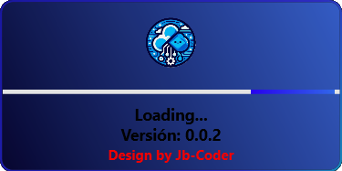
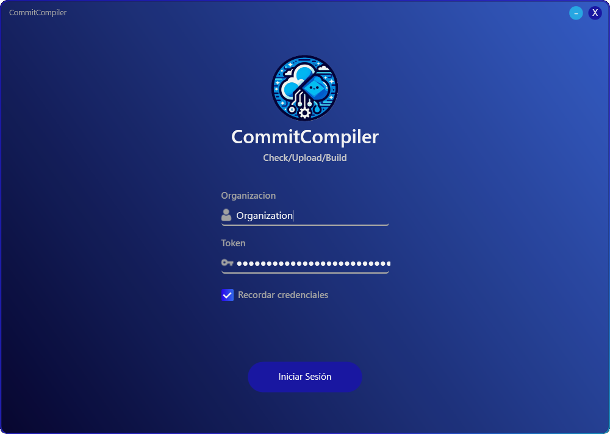
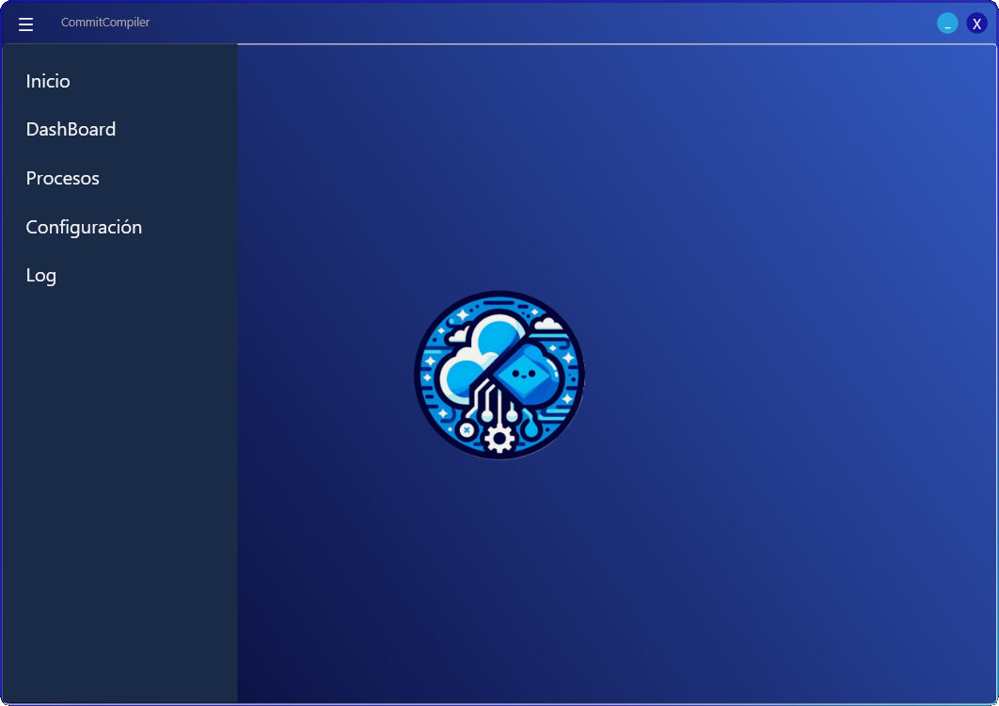
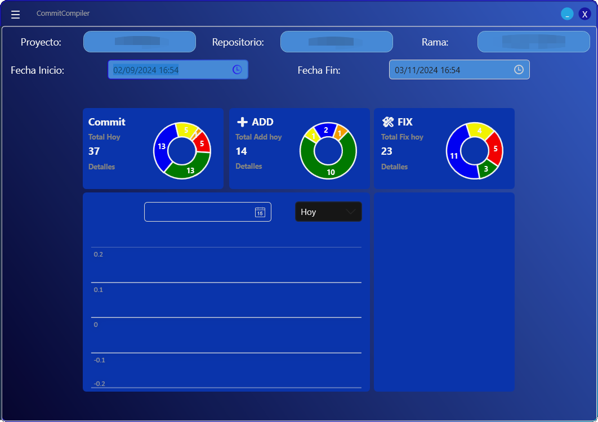
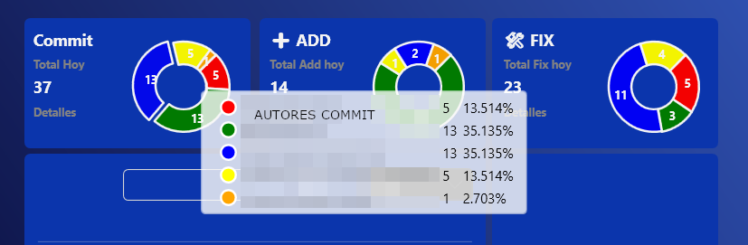
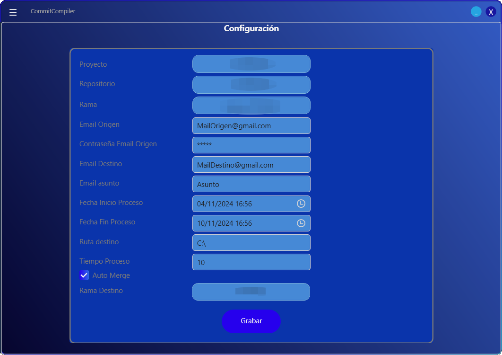

# CommitCompiler


CommitCompiler is a client-server application designed to streamline the management of projects and repositories within your Azure organization. This tool automates the merging of branches, generates builds to a specified destination, and provides insightful dashboards for monitoring.

## Overview

The application consists of two main components:

- **Client Application:** Built using .NET 6, WPF, and MVVM design pattern. It offers a user-friendly interface to interact with the server, display project and repository information, and visualize data through charts.

- **Server Application:** Developed as a .NET 6 console application. It handles branch merging and build generation based on configurations set through the server application.

### Features

- **Automated Branch Merging:** Configure settings for automatic branch merges, ensuring your codebase remains up-to-date with minimal manual intervention.

- **Build Generation:** Automatically triggers builds in a designated output path following successful merges.

- **SQLite Database:** Utilizes SQLite for lightweight and efficient data storage.

- **Dashboard:** Provides a graphical overview of project metrics with small charts to visualize important data at a glance.

- **Logging:** Retrieves and displays logs from the server, offering insights into operations and status.

## Technologies Used

- **Client:** 
  - .NET 6
  - WPF
  - MVVM Design Pattern
  - Entity Framework
  - HandyControl
  - LiveCharts
  - Xunit
  - Moq
- **Server:** 
  - .NET 6
  - Console Application
  - Entity Framework

## Screenshots

### Splash Window
<p align="center">
    
</p>

### Login
<p align="center">
    
</p>

### Main
<p align="center">
    
</p>

### DashBoard
<p align="center">
    
    
</p>

### Configuration
<p align="center">
    
</p>

## Getting Started

To get started with CommitCompiler, clone the repository and follow the setup instructions:

1. Clone the repository:
   ```bash
   git clone https://github.com/yourusername/CommitCompiler.git
